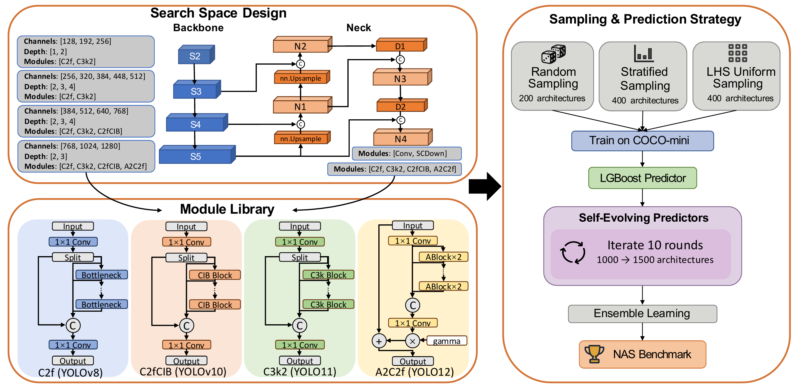

<div align="center">

# YOLO-NAS-Bench: A Surrogate Benchmark with Self-Evolving Predictor for YOLO Architecture Search

**CVPR 2026 Workshop · Oral**

Zhe Li · Xiaoyu Ding · Jiaxin Zheng · Yongtao Wang

</div>

---

This is the official implementation of **YOLO-NAS-Bench**, the first surrogate benchmark tailored to YOLO-style object detectors. It provides a ground-truth architecture database, a high-fidelity LightGBM ensemble predictor trained via a Self-Evolving mechanism, and a unified evaluation protocol for fair NAS comparison.

<div align="center">

</div>

---

## Citation

```bibtex
@inproceedings{li2026yolonasbench,
  title     = {YOLO-NAS-Bench: A Surrogate Benchmark with Self-Evolving Predictor for YOLO Architecture Search},
  author    = {Li, Zhe and Ding, Xiaoyu and Zheng, Jiaxin and Wang, Yongtao},
  booktitle = {Proceedings of the IEEE/CVF Conference on Computer Vision and Pattern Recognition Workshops (CVPRW)},
  year      = {2026}
}
```

---

## Acknowledgements

This work is supported by the Wangxuan Institute of Computer Technology, Peking University. We thank the [Ultralytics](https://github.com/ultralytics/ultralytics) team for their excellent open-source YOLO implementations, which form the backbone of our search space.

---

## License

This project is only free for academic research purposes, but needs authorization for commerce. For commerce permission, please contact [wyt@pku.edu.cn](mailto:wyt@pku.edu.cn).